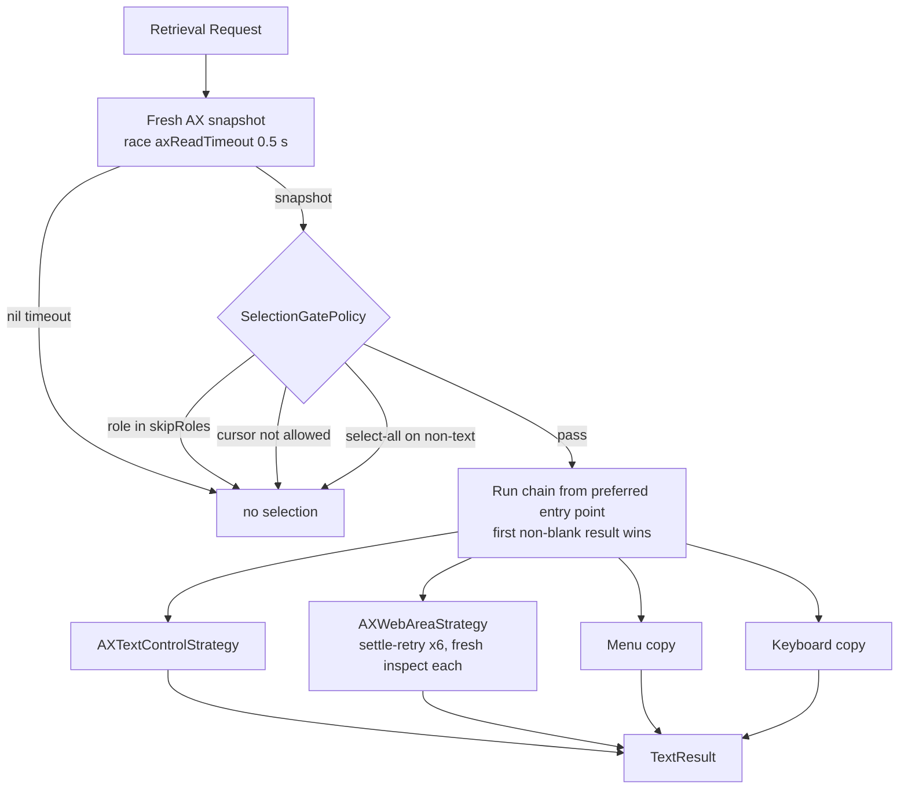

# Text Selection Subsystem Architecture

The text selection subsystem detects user text selection events across all macOS applications and extracts selected text non-destructively, then hands it to the popup.

---

## Selection Detection Architecture

The subsystem consists of three primary components:

```
+------------------------+   +-----------------------+
| MacSelectionMonitor |-->| RuleEngine |
| (Global Mouse/AX Event)|   | (Per-App Policy) |
+------------------------+   +-----------------------+
 |                |
 | builds         v
 |          +-----------------------+
 |          | SelectionContext |
 |          +-----------------------+
 v                |
+------------------------+      |
| SelectionRetrievalCoordinator |      |
| (Gate + Mode Routing) |      |
+------------------------+      |
                        v
             +-----------------------+
             | onSelection callback |
             | (PopupWindowController) |
             +-----------------------+
```

1. **[`MacSelectionMonitor`](../../Sources/OpenClip/Platform/MacSelectionMonitor.swift)**: Listens for mouse release events (`leftMouseUp`) and keyboard selection gestures (⌘A select-all, ⇧+arrow) and dispatches retrieval.
2. **`SelectionRetrievalCoordinator`** (from `OpenSelection` package via [`OpenSelectionBridge`](../../Sources/OpenClip/Platform/Selection/OpenSelectionBridge.swift)): Applies the gate, resolves the app's retrieval mode from [`AppPolicyContext`](../../Sources/Core/Rules/AppRule.swift), and routes to the matching strategy.
3. **Context assembly**: `MacSelectionMonitor` resolves app rules via [`RuleEngine`](../../Sources/Core/Rules/RuleEngine.swift), builds a [`SelectionContext`](../../Sources/Core/Selection/SelectionContext.swift), and notifies subscriber callbacks (such as `PopupWindowController`).

---

## Retrieval: Resolver, Gate, and Strategies

Every retrieval request (mouse-up drag, ⌘A/⇧+arrow gesture, or the ⌥⌘C hotkey) runs through `SelectionRetrievalCoordinator.retrieve(for:policy:cursor:)`:

1. **Fresh AX snapshot** — `AXElementInspector.inspect()` resolves the focused application, then the focused UI element *from that application*, never from the system-wide element (the classic source of stale reads). It collects the role, parent/container roles, selection attributes, and selection bounds. The blocking snapshot runs on the dedicated `com.openclip.ax-inspect` queue, raced against `Constants.axReadTimeout` (0.5 s) via a once-resume gate; a hung or unresponsive target yields `nil` instead of stalling the popup.
2. **Gate** — [`SelectionGatePolicy`](../../Sources/Core/Rules/SelectionGatePolicy.swift) decides whether to attempt retrieval at all:
   - `skipRoles` — AX roles that can never hold a text selection (buttons, menus, scrollbars, …) are rejected up front.
   - `allowedCursors` — the cursor class (from `CursorClassifier` in `OpenSelection`) must suggest a text context; `.unknown` is never a reason to block.
3. **Strategy chain** — a single canonical fallback order selects the first working strategy. The app's [`SelectionRetrievalMode`](../../Sources/Core/Rules/SelectionRetrievalMode.swift) picks the *entry point* into that chain; retrieval then runs that strategy and every strategy below it. An app with no rule starts at `ax-text-control` (the top), which is the "auto" behavior.

The canonical chain:

```
ax-text-control → ax-web-area → menu-copy → keyboard-copy
```



Chain suffix per preferred mode:

| Preferred mode | Strategies run (in order) |
| :--- | :--- |
| `ax-text-control` (default / no rule) | AX text → (embedded web-area detected? AX web area → keyboard copy; otherwise AX text → keyboard copy) |
| `ax-web-area` (browsers) | AX web area → keyboard copy |
| `browser-script` (legacy alias) | AX web area → keyboard copy |
| `menu-copy` | menu copy |
| `keyboard-copy` | keyboard copy |

Web selections run directly through native Accessibility (`AXWebArea`), reading `kAXSelectedTextMarkerRange` in <1 ms without spawning subprocesses or requiring Apple Events permissions. If Accessibility yields no text (e.g. Google Docs canvas or custom editors), the coordinator falls back to `keyboard-copy`.


### Retrieval modes

| Mode | kebab-case key | Strategy |
| :--- | :--- | :--- |
| AX native text control | `ax-text-control` | `AXTextControlStrategy` reads `kAXSelectedTextAttribute` (falling back to `value` + `selectedTextRange` substring) and the selection bounds. Zero pasteboard side-effects. Default. |
| AX web area | `ax-web-area` | `AXWebAreaStrategy` reads `kAXSelectedTextMarkerRange` → `AXStringForTextMarkerRange` (fallback `selectedText`). Includes a **settle-retry** loop: the snapshot is re-inspected fresh on every retry (up to `webAreaSettleMaxRetries` = 6, `webAreaSettleInterval` = 50 ms apart) so text appearing after focus is observed instead of a frozen target. `AXElementInspector` walks up to 25 ancestor levels and searches the window on focus mismatch. |
| Browser script (legacy) | `browser-script` | Formerly used AppleScript `execute javascript`; now maps directly to `ax-web-area` with `keyboard-copy` fallback to eliminate subprocess latency and permission friction. |
| Menu copy | `menu-copy` | `PasteboardCopyEngine` archives the pasteboard, AXPresses the app's **Edit ▸ Copy** menu item (matched by action identifier `copy:`, ⌘C key equivalent, or localized title via `AXMenuNavigator`), polls for an advanced `changeCount` with non-empty text, then restores. The press shares `inspectGate` and uses `axReadTimeout`, same as inspect. Used for terminals. |
| Keyboard copy | `keyboard-copy` | The same engine with a synthesized ⌘C key event (`SessionEventTapPoster`) as the trigger. Used for custom code editors and Electron apps whose AX selection reads are unreliable. |

### The copy engine and transient markers

Both copy modes run through [`PasteboardCopyEngine`](../../Sources/OpenClip/Platform/PasteboardCopyEngine.swift): archive every type of every pasteboard item → run the trigger → poll every 2 ms up to a per-app timeout (`pasteboardCopyTimeout` 0.25 s, or `safariPasteboardCopyTimeout` 0.6 s for browsers) for an advanced `changeCount` yielding non-empty text (a `changeCount` advance with empty content keeps polling, covering the transient clipboard race; recopying identical text succeeds as long as `changeCount` advances) → read the new string → restore the archived items **synchronously before returning**, tagged with the **nspasteboard markers** `org.nspasteboard.TransientType` and `org.nspasteboard.AutoGeneratedType` (empty data). The markers tell clipboard managers to skip the restore as a user-visible copy. The clipboard is therefore clean by the time retrieval returns; there is no lingering visibility window.

### Per-app routing (default catalog)

`DefaultAppRules.catalog` assigns modes to app groups; `RuleEngine.resolvePolicies` matches the frontmost app's bundle id (with `.*` prefix / `*` wildcards) against default + user rules. User rules in `~/.openclip/rules.json` override per-key — see `docs/user-guide/app-rules.md` for the JSON keys.

| Group | Target Application Category | Mode |
| :--- | :--- | :--- |
| `safariGroup` | Safari & WebKit-based browsers | `ax-web-area` |
| `chromiumGroup` | Chromium-based browsers | `ax-web-area` |
| `firefoxGroup` | Firefox & Gecko-based browsers | `ax-web-area` |
| `arcGroup` | Arc browsers | `ax-web-area` |
| `keyboardCopyApps` | Code editors, IDEs, markdown & note apps | `keyboard-copy` |
| `menuCopyApps` | Terminal emulators | `menu-copy` |
| `denyPasteApps` | Applications requiring paste suppression | `denyPaste: true` |
| default | All other standard applications | `ax-text-control` |

---

## Shortcut Clipboard Fallback & Synchronous Resolution

The retrieval path above applies to *passive selection monitoring*. The global toggle shortcut ([`HotkeyManager`](../../Sources/OpenClip/Platform/HotkeyManager.swift)) runs a strictly **synchronous resolution pipeline** on `@MainActor` without incurring asynchronous AX query latency:

1. **Monitored Selection Reuse**: The hotkey checks `selectionMonitor.synchronousSelection(for: frontmostBundleID)`. If the user recently selected text in the active application and that selection has not expired (`Constants.selectionMaxAge` = 30 s) or been cleared by caret navigation / typing, the monitored selection is reused immediately.
2. **Clipboard Fallback**: If no valid monitored selection exists, OpenClip falls back to the current contents of `NSPasteboard.general` so the search palette still has input to act on.
   - The context is flagged `SelectionContext.isClipboardFallback`; `PopupWindowController.show` filters available actions down to **Paste** (and AI Tools launcher).
3. **Empty Context Fallback**: If the clipboard is also empty, an empty selection context is created with the frontmost app's identity, allowing standalone actions to run.

Passive selection monitoring continues even when "Appear Automatically" is disabled (`isAppEnabled == false` or `hotkeyOnly: true`), updating `latestSelection` and pre-warming the search index in the background so pressing the shortcut opens the palette with zero perceptual delay. `isAppEnabled` is the global form of the per-app `hotkeyOnly` rule: it gates only the monitor's passive (mouse-release/keyboard) auto-show. The explicit hold gesture delivers straight from `handleMouseDown` and stays unaffected.

---

## Privacy & Non-Destructive Guarantees

- **No Clipboard Pollution (AX modes)**: `ax-text-control`, `ax-web-area`, and `browser-script` never write to `NSPasteboard` — they read the live accessibility tree or the browser's AppleScript bridge.
- **Copy modes are archive-and-restore**: `menu-copy`/`keyboard-copy` temporarily place the selected text on the general pasteboard, then restore the archived items tagged with the nspasteboard transient markers so clipboard managers don't treat the restore as a user copy.
- **Ignored Fields**: Secure text fields (such as password inputs or masked text areas) do not expose `kAXSelectedTextAttribute` through AX APIs, ensuring password security.